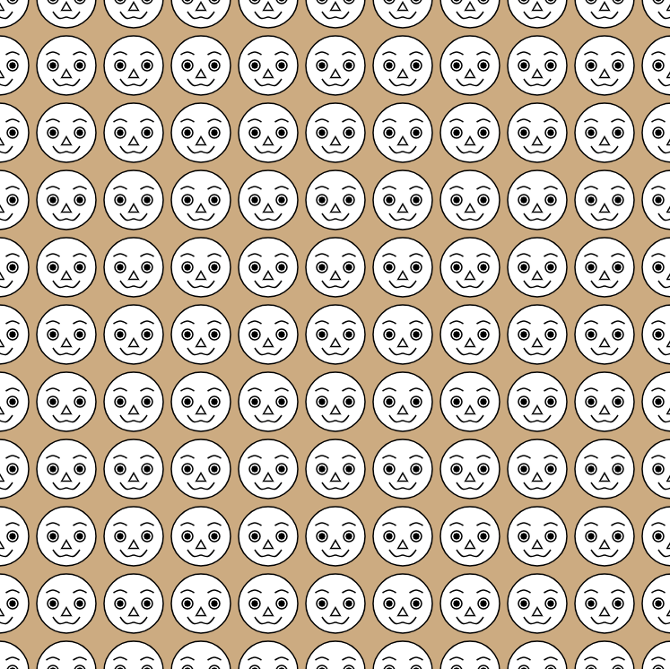
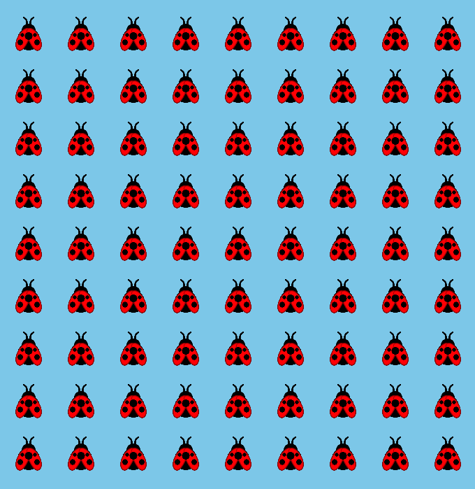
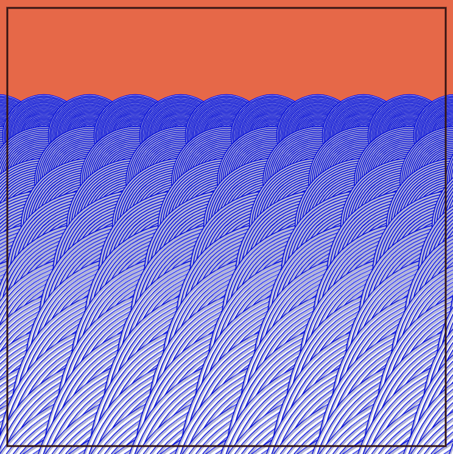
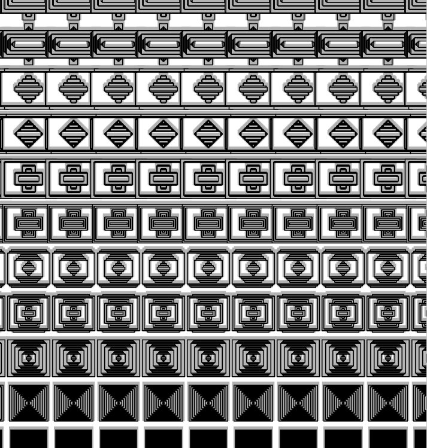

<h1>Generative Art</h1>

Various visual experiments made using the Two.js library.

<h2>Patterns</h2>

  
  
  
  
  
    

  
<h3>Faces (<a href="https://github.com/anokhee/creative_coding/tree/master/two-js/pattern-gen/faces.js">two-js/pattern-gen/faces.js</a>)</h3> 
  
  
<h3>Ladybugs (<a href="https://github.com/anokhee/creative_coding/tree/master/two-js/pattern-gen/ladybugs.js">two-js/pattern-gen/ladybugs.js</a>)</h3> 
  
  
<h3>Wave (<a href="https://github.com/anokhee/creative_coding/tree/master/two-js/pattern-gen/waves.js">two-js/pattern-gen/waves.js/</a>)</h3> 
  

<h3>Bismuth (<a href="https://github.com/anokhee/creative_coding/tree/master/two-js/pattern-gen/bismuth.js">two-js/pattern-gen/bismuth.js</a>)</h3> 
  
  
  

  

  

<h2>Face Generator - <a href="http://anokhee.github.io/v2">Live</a></h2>

  
  
   
  
  
  

<h2>Bullseye - <a href="http://anokhee.github.io/bullseye">Live</a></h2>

  
  

