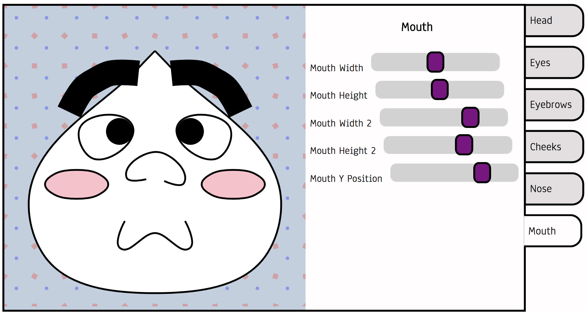
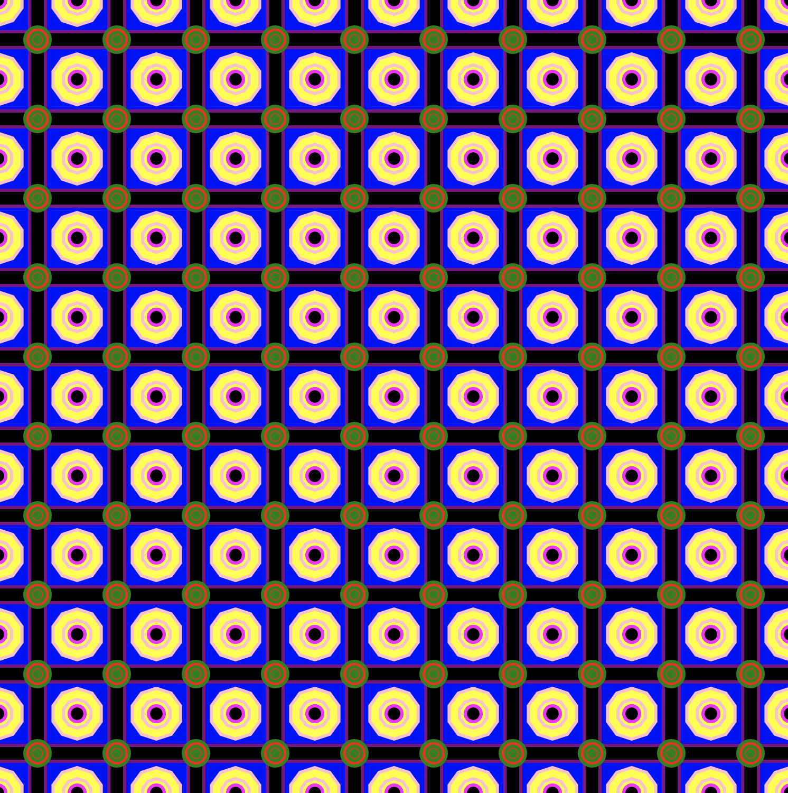
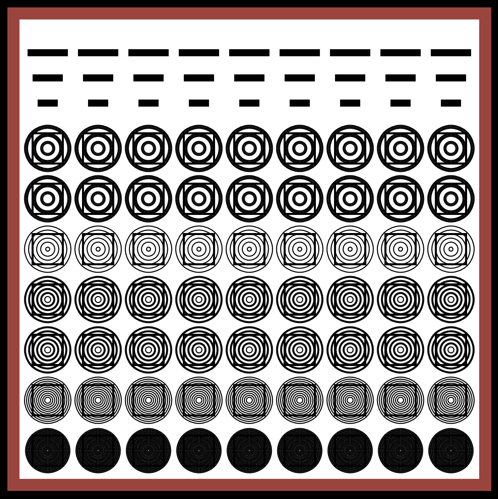

<h1>Generative Art</h1>

Various visual experiments made using the Two.js library.

<h2>Face Generator</h2>
A small Face Generator, inspired in part by Miis and <a href="http://bobobo.wikia.com/wiki/J">J from Bobobo-bo Bo-bobo</a>. It was originally created as a tool for me to play around with Bezier curves and retrieve values to create animations with Two.js. 

Live demos of previous iterations of this idea:  
<a href="http://anokhee.github.io/v2/">Version 2</a>  <a href="http://anokhee.github.io/make_a_buddy/">Version 1</a>

  
 

<h2>Patterns</h2>

  
Below are 12 patterns I was able to generate to the browser using the Two.js library. Each of these patterns was created using the same basic algorithm: a triple-nested for loop (i > j > k [optional]*), with i being the number of shapes along the x axis, j being the number of shapes along the y axis, and k being the radius of the shape (or largest shape, if nested).  

Notes: 

1. k is marked as optional because it can be removed from the nested loop altogether. Removing k will generate the repeated shape as a single, unstacked shape with a fixed radius value.

2. I don't currently have a live demo of these patterns being generated because the browser renders some of these files (namely those like bismuth.js) <i>verrry slowly</i> :-P...Please feel free to clone whatever you want to if you're interested, but if you want to play with the algorithm you may experience some slowness or crashing if the math gets too crazy. 

3. If you happen to know of a more efficient way to render patterns like this, please let me know.

  
  
 <h4>"Special" Patterns</h4>
 
Clicking on one of these patterns will take you to its code.

  
    
     
  
   
      
      
  <h4>Other Patterns</h4>
  
These don't have an associated code file. 

  
  
  
  
  
  
      
  

 
<h2>Bullseye - <a href="http://anokhee.github.io/bullseye">Live</a></h2>

  
  

