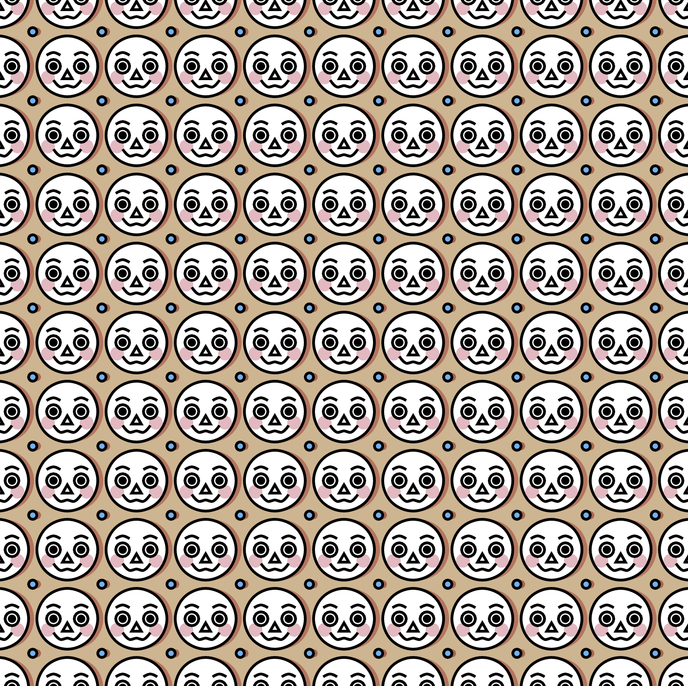

<h1>Generative Art</h1>

Various visual experiments made using the Two.js library.

<h2>Patterns</h2>

  
  
 <h3>Special Patterns</h3>
 
Clicking on one of these patterns will take you to its code.

  
    
     
  
   
      

 
  
  
  

<h2>Face Generator </h2>

  
  
   
  
  
  

<h2>Bullseye - <a href="http://anokhee.github.io/bullseye">Live</a></h2>

  
  

