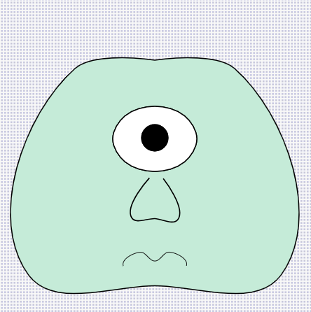
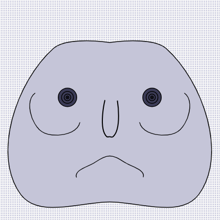

<h1>Generative Art</h1>

Various visual experiments made using the Two.js library.

<h2>Face Generator - <a href="http://anokhee.github.io/v2">Live</a></h2>

  
  
   
  
  
  
 

<h2>Bullseye - <a href="http://anokhee.github.io/bullseye">Live</a></h2>

